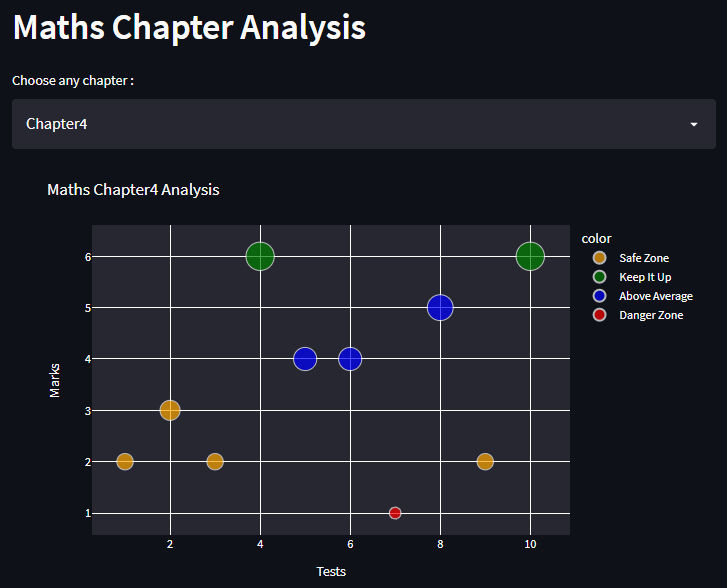
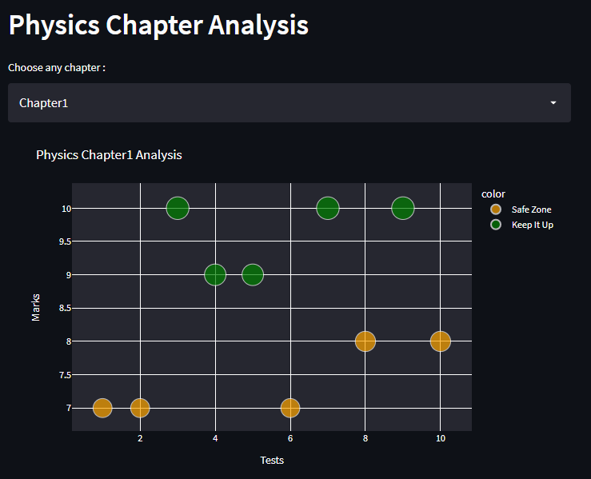
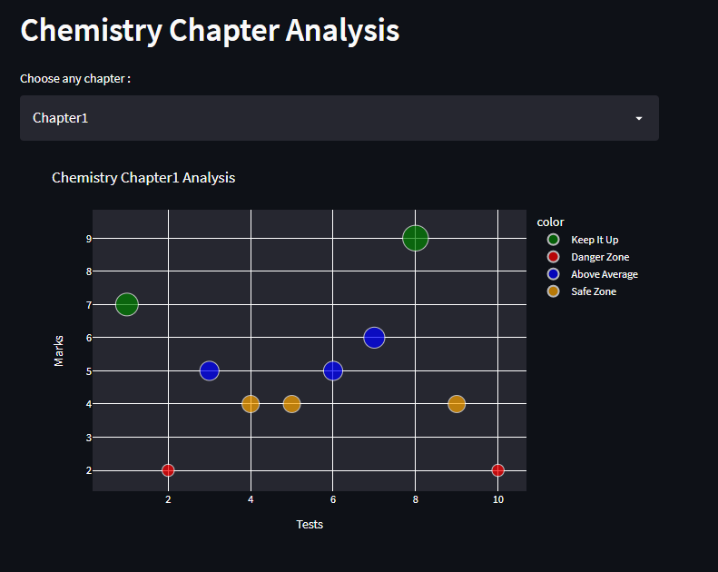

# Techforgood2022
This is a basic student performance analysis with predefined data using basics of machine learning. Here the marks are labelled in a graph for each subject and its chapters. It is done using K-Clustering algorithom which is an unsupervised learning algorithm. Here a subject mark's labels are grouped into one single cluster.

## Deployment
check here for the results: <a href="https://share.streamlit.io/muditbaid/techforgood2022/main/modplott.py">Click here!</a>

<h2>A short glimpse of our work</h2>
 

